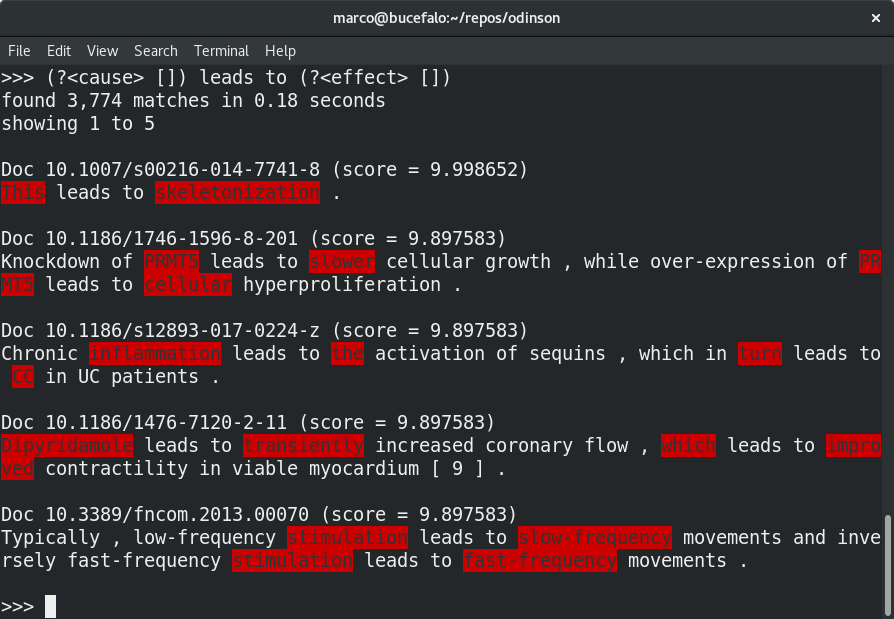

---  
title: Odinson shell
has_children: false 
nav_order: 7
---  

# Odinson shell

One way of interacting with Odinson is through the shell.  To launch:

```bash
docker run \
  --name="odinson-extras" \
  -it \
  --rm \
  -e "HOME=/app" \
  -v "/path/to/data/odinson:/app/data/odinson" \
  --entrypoint "bin/shell" \
  "lumai/odinson-extras:latest"
```

**NOTE**: Replace `/path/to/data/odinson` with the path to the directory containing `index` (created via the `IndexDocuments` runnable).


## Shell Examples

We have made a few example queries to show how the system works. For this we used a collection of 8,479 scientific papers (or 1,105,737 sentences). Please note that the rapidity of the execution allows a user to dynamically develop these queries in real-time, immediately receiving feedback on the coverage and precision of the patterns at scale.

### Example of a surface pattern for extracting casual relations.

This example shows odinson applying a pattern over surface features (i.e., words) to extract mentions of causal relations. Note that Odinson was able to find 3,774 sentences that match the pattern in 0.18 seconds.




### Example of a doubly-anchored Hearst pattern to extract hypernymy (i.e., _X_ isA _Y_)

This example shows how Odinson can also use patterns over syntax. In this case it tries to find hypernym relations. It finds 10,562 matches in 0.37 seconds.


### Example of how a surface pattern can be extended (using syntax patterns) to extract additional contextual information.

This example shows how surface and syntax can be combined in a single pattern. This pattern finds 12 sentences that match in our corpus of 1,105,737 sentences. It does this in 0.01 seconds.


### Example of a causal pattern written over dependency syntax with a lexical trigger (i.e., _cause_).

This example shows how we can match over different aspects of tokens, lemmas in this example. Note that the ability to utilize syntax helps with the precision of the extractions (as compared with the overly simple surface rule above). Odinson finds 5,489 matches in 0.18 seconds.


### Example of how more complex patterns can be developed, for example, to extract the polarity of a causal influence and a context in which it applies.

This is an example of a slightly more complex pattern. Odinson is able to apply it over our corpus and finds 228 matches in 0.04 seconds.


